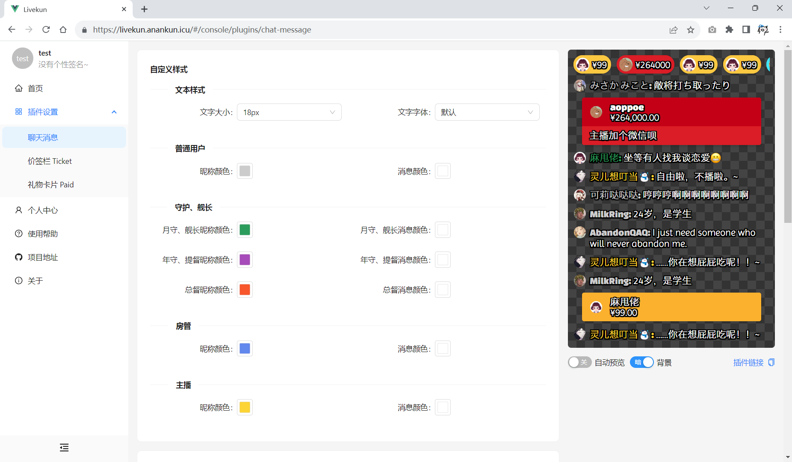
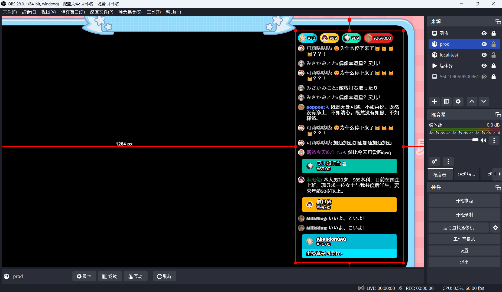

# Livekun

一个支持多直播平台 YouTube 风格的 OBS 互动插件系统，该项目目前正在开发中

## 软件截图

## 功能特性

* 开箱即用的插件，无须繁琐的配置，直接添加至 OBS Studio 中即可使用

* 内置类 YouTube 直播风格的礼物打赏信息插件、聊天弹幕插件

* 可在后台远程控制 OBS Studio 中的插件，与插件交互

* 多直播平台支持，目前仅支持 CC 直播，更多平台正在适配中...

* 更多插件和功能正在开发中...

## 开源许可信息

* [blivechat](https://github.com/xfgryujk/blivechat), Licensed under MIT license.

## License

[MIT](LICENSE)
